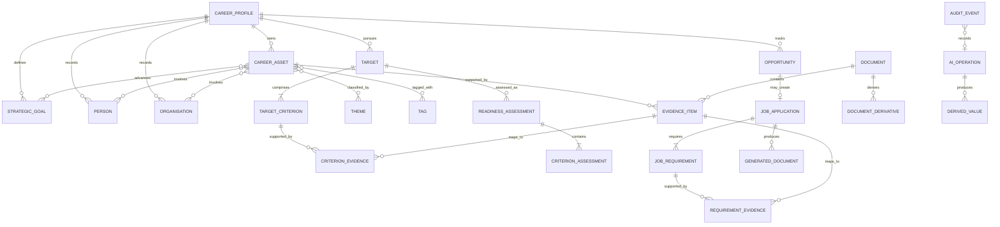

# Domain Model

## Modelling approach

The source of truth is relational. A typed association model supplies graph-like navigation without introducing a graph database in the MVP. Domain records use UUIDs, UTC timestamps, explicit provenance, and optimistic/version fields where concurrent or repeated AI work could otherwise overwrite changes.

## Entity relationship diagram



## Core aggregates

### CareerProfile

The root for current professional identity and adopted strategy. Mission, narrative, and goals are user-authoritative.

### CareerAsset

A reusable unit of professional capital. The asset describes the event or contribution; evidence establishes that it occurred and supports its impact. Categories are reference data so new professions can extend them without schema changes.

Recommended common fields:

- `id`, `title`, `description`, `category_code`, `subcategory`
- `start_date`, `end_date`, `date_precision`
- `status`, `impact_summary`, `visibility`
- `organisation_id`, `role`
- `source_kind`, `created_at`, `updated_at`, `archived_at`

### EvidenceItem and Document

`Document` represents a stored file and its handling policy. `EvidenceItem` represents a usable passage, claim, URL, or description that can support one or more assets or criteria. This separation allows one source document to provide multiple pieces of evidence.

Important document fields:

- Original filename, MIME type, byte size, SHA-256 checksum, relative path.
- Storage class: original, derived, or generated.
- AI handling policy: AI allowed, local only, or redacted.
- Extraction status, extractor version, and error details.

### Opportunity

A potential career action. The opportunity stores score inputs; computed results are recalculated by a versioned scoring service rather than accepted blindly from clients.

### Target and TargetCriterion

A generic model for roles, awards, fellowships, recognition, advisory positions, and trajectories. Criteria are user-defined. AI proposals are staged as suggestions until adopted.

### JobApplication and JobRequirement

A specialised workflow attached to a job opportunity. Extracted requirements are drafts until confirmed by the user. Evidence mappings power analysis and generation.

### AI operation and derived values

Every AI call creates an `AI_OPERATION` record containing operation type, provider, model, prompt/template version, timing, status, token/usage metadata when available, and references to eligible inputs. Secrets and unrestricted source bodies are excluded from operational logs.

AI-provided values are stored as derived records or explicitly marked fields. They must never replace the user-authoritative representation.

## Typed relationships

Rather than one unconstrained universal edge table, explicit join tables should cover important referential relationships. A limited `EntityLink` may support exploratory AI suggestions with:

- Source entity type and ID.
- Target entity type and ID.
- Relationship type.
- State: suggested, active, dismissed.
- Source: user, import, rule, or AI.
- Confidence and explanation when derived.

Before an `EntityLink` influences readiness or generated claims, its relationship type must be supported by an application rule. This prevents an unvalidated graph suggestion from being treated as factual evidence.

## Provenance and precedence

Values use the following authority order:

1. Current user-entered or user-confirmed value.
2. Imported value explicitly accepted by the user.
3. Deterministically extracted source value.
4. AI-derived value.

Lower-authority values may be retained as suggestions but cannot overwrite higher-authority values. User deletion or correction of an AI-derived tag creates a suppression record so routine re-enrichment does not immediately recreate it without new evidence or an explicit reset.

## Scoring model

Inputs:

- Strategic value `V`: integer 1–5.
- Probability `P`: integer 0–100, converted to `p = P / 100`.
- Effort `E`: integer 1–5.

Raw score:

```text
raw_priority = (V × p) / E
```

The theoretical range is 0–5. The displayed score is:

```text
priority_score = round((raw_priority / 5) × 100, 1)
```

Equivalent simplified form:

```text
priority_score = round(V × P / (5 × E), 1)
```

Deadline urgency is a separate indicator in the MVP and does not modify the base priority score. Score records include an algorithm version so later changes remain explainable.

## Readiness model

Each adopted target contains criteria with positive weights. Weights are normalised at assessment time. Each criterion receives:

- Coverage from 0 to 100.
- Confidence from 0 to 100, labelled as assessment confidence rather than success probability.
- Mapped evidence and gaps.
- An explanation and recommended action.

Initial readiness calculation:

```text
readiness = sum(normalised_weight × coverage)
```

Confidence is displayed separately and does not inflate readiness. Every assessment is versioned with a snapshot of criteria, evidence mappings, algorithm version, and time.

## Lifecycle enums

Final API enum names will be defined during implementation, with these semantic states:

- Asset: draft, active, archived.
- Opportunity: discovered, reviewing, planned, pursuing, submitted, won, lost, declined, expired, archived.
- Target: suggested, adopted, paused, achieved, abandoned, archived.
- Requirement: extracted draft, confirmed, excluded.
- Job application: captured, analysing, preparing, ready, submitted, interviewing, offered, unsuccessful, withdrawn, archived.
- AI operation: queued, running, succeeded, partially succeeded, failed, cancelled.
- Import: uploaded, validating, ready, importing, completed, completed with warnings, failed, cancelled.

