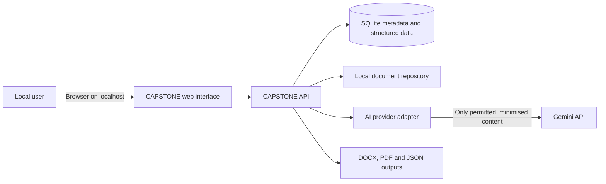
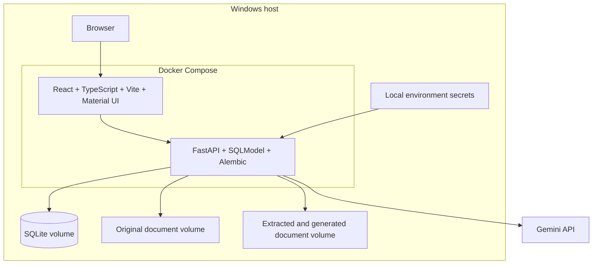
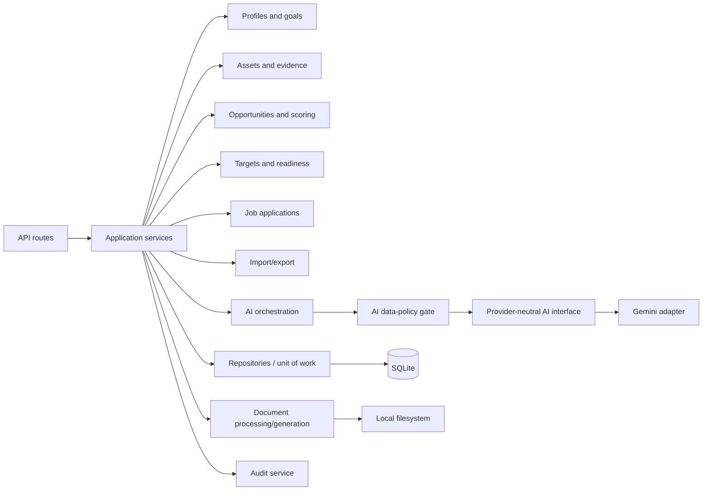
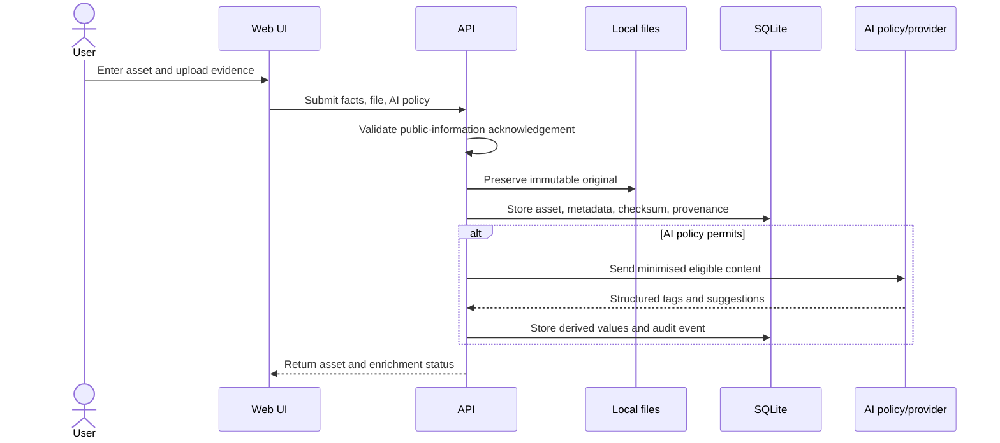
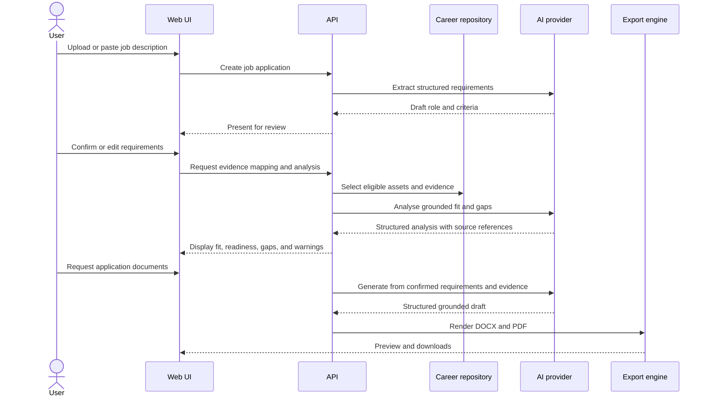

# System Architecture

## Context



CAPSTONE is deployed locally with Docker Compose. The browser interface communicates only with the local API. The API owns persistence, scoring, document processing, AI policy enforcement, and generation.

## Container view



## Backend modules



Module boundaries are logical within a modular monolith. A distributed architecture would add operational cost without helping the single-user MVP.

## Repository structure

```text
CAPSTONE/
├── backend/
│   ├── app/
│   │   ├── api/
│   │   ├── core/
│   │   ├── db/
│   │   ├── models/
│   │   ├── repositories/
│   │   ├── schemas/
│   │   └── services/
│   ├── migrations/
│   └── tests/
├── frontend/
│   ├── src/
│   └── tests/
├── data/
│   ├── originals/
│   ├── derived/
│   ├── generated/
│   ├── imports/
│   └── backups/
├── schemas/
├── docs/
├── tests/e2e/
├── docker-compose.yml
└── README.md
```

Runtime data directories will be ignored by Git. Placeholder files may preserve the intended directory structure.

## Key data flows

### Asset ingestion



### Job application



## Persistence rules

- SQLite contains structured domain data, extracted text where appropriate, metadata, stable relative paths, checksums, and audit data.
- Original document binaries are stored beneath `data/originals` and are not overwritten.
- Derived text and transformations are stored beneath `data/derived`.
- Generated application documents are stored beneath `data/generated`.
- Paths stored in the database are relative to a configurable data root to keep backups portable.
- File writes use staged temporary files and atomic moves where supported.
- Deleting a domain link does not silently delete an original document; retention is explicit.

## Technology baseline

| Concern | Selection |
|---|---|
| Frontend | React, TypeScript, Vite, Material UI |
| Backend | FastAPI, Python, SQLModel |
| Migration | Alembic |
| Database | SQLite for MVP |
| AI | Provider interface with Gemini adapter first |
| Backend tests | Pytest |
| Frontend tests | Vitest and Testing Library |
| End-to-end tests | Playwright |
| Local deployment | Docker Compose on Windows |
| Documents | Local filesystem; metadata in SQLite |
| Export | DOCX, PDF, versioned JSON |

## Future compatibility

The MVP does not implement multi-tenancy, but domain identifiers and repository boundaries should avoid assumptions that prevent later migration to PostgreSQL and authenticated users. Premature `user_id` and `workspace_id` columns will not be added everywhere until their semantics are designed in the multi-user phase.

